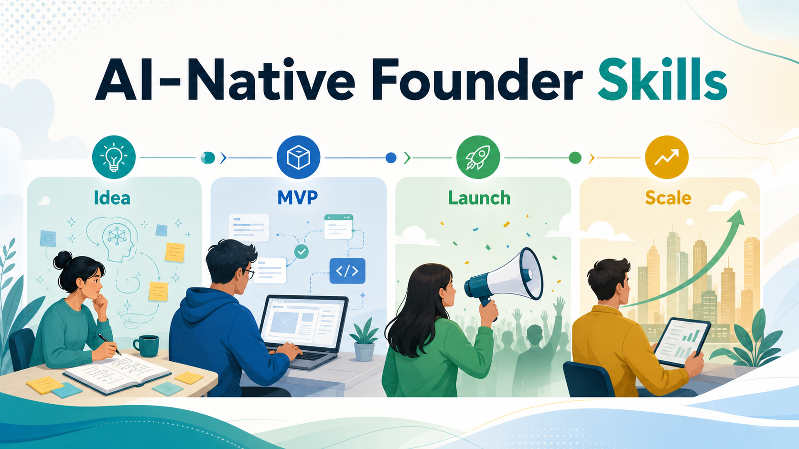
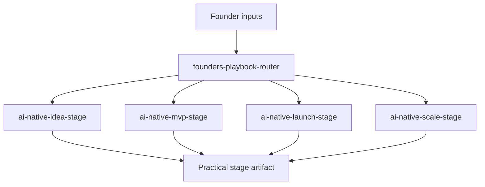

# AI-Native Founder Playbook Skills



Provider-neutral AI agent skills for founders building AI-native startups across four stages: Idea, MVP, Launch, and Scale.

This pack turns a long founder playbook into focused skills that help you decide what to do next, what inputs to provide, and what output to expect. The workflows do not require any specific AI provider.

## Quick Use

These skills are Markdown instruction folders. Any AI agent can use them by loading the relevant `SKILL.md` file and, when needed, the linked files in that skill's `references/` folder.

## Quick Install

Use `install.sh` unless you want to copy files manually. The script is only a convenience wrapper around the manual commands below.

```bash
./install.sh codex    # install for Codex
./install.sh claude   # install for Claude Code
./install.sh gemini   # install Gemini CLI commands
./install.sh all      # install all supported targets
```

After installing, start a fresh agent session and ask:

```text
Use the founders-playbook-router skill to interview me, diagnose my startup stage, and recommend what to do next.
```

### Manual Install

Use this section if you prefer to see exactly what gets copied.

Codex copies the skill folders into your local Codex skills directory:

```bash
mkdir -p "${CODEX_HOME:-$HOME/.codex}/skills"
cp -R skills/* "${CODEX_HOME:-$HOME/.codex}/skills/"
```

Claude Code can install the same skill folders globally:

```bash
mkdir -p "$HOME/.claude/skills"
cp -R skills/* "$HOME/.claude/skills/"
```

Or into a single project:

```bash
mkdir -p .claude/skills
cp -R skills/* .claude/skills/
```

Gemini CLI uses custom commands rather than skill folders. This repo includes command wrappers in `.gemini/commands/founder-playbook/`.

You can use them directly from this repo:

```bash
gemini
```

Then run:

```text
/founder-playbook:router I have a rough AI product idea and I am not sure where to start.
```

To install the commands globally:

```bash
mkdir -p "$HOME/.gemini/commands/founder-playbook"
cp .gemini/commands/founder-playbook/*.toml "$HOME/.gemini/commands/founder-playbook/"
```

Global Gemini commands still need access to this repo's `skills/` files. Run Gemini from the repo root, or copy this repo into the project where you want to use the commands.

If you copy only the `.toml` command files without the `skills/` directory, the commands will not have the playbook instructions they reference.

Available Gemini commands:

```text
/founder-playbook:router
/founder-playbook:idea
/founder-playbook:mvp
/founder-playbook:launch
/founder-playbook:scale
```

## Use With Any Agent

For agents with project or file context:

```text
Use the founder playbook router skill from skills/founders-playbook-router/SKILL.md.
Interview me, diagnose my startup stage, and recommend what to do next.
```

For agents that support skill-folder installation, copy or import the folders under `skills/` into that agent's skill library.

Start with:

```text
Use the founders-playbook-router skill to diagnose my startup stage and tell me which founder playbook skill to use.
```

You do not need to fill in every field. If you only have a rough idea, invoke the router or a stage skill and ask it to interview you.

## Start Here

If you are not sure which skill you need, use the router.

```text
Use the founders-playbook-router skill.

Company/stage:
Target customer:
Problem hypothesis:
Current product status:
Existing users/customers:
Current AI tools:
Biggest constraint:
Desired output:
```

If you do not have those answers yet, use guided intake:

```text
Use the founders-playbook-router skill to interview me, diagnose my stage, and recommend what I should do next.
```

## Skills

| Skill | Use When | Typical Output |
| --- | --- | --- |
| `founders-playbook-router` | You are unsure where to start or which stage applies. | Stage diagnosis and next skill recommendation. |
| `ai-native-idea-stage` | You have an idea, hypothesis, or customer segment but need evidence. | Validation memo, discovery plan, opportunity scorecard, wedge. |
| `ai-native-mvp-stage` | You have a validated problem and need to scope/build the first useful product. | MVP scope, architecture plan, coding-agent tasks, eval plan. |
| `ai-native-launch-stage` | You have an MVP or beta and need first customers, pricing, onboarding, or feedback. | Launch plan, positioning, sales script, onboarding plan. |
| `ai-native-scale-stage` | You have traction and need repeatable GTM, operations, hiring, metrics, or fundraising. | Scale diagnosis, metrics spec, hiring plan, operating cadence. |

## Input Checklist

Use this universal template with any skill when you already have the details:

```text
Company/stage:
Target customer:
Problem hypothesis:
Current product status:
Existing users/customers:
Current AI tools:
Biggest constraint:
Desired output:
```

When you do not have the details, ask the skill to collect them:

```text
Use the ai-native-idea-stage skill to interview me about my startup idea, then recommend the best validation plan.
```

Each skill will ask a compact set of high-impact questions, infer reasonable defaults, mark unknowns, and then produce the requested artifact.

Stage-specific additions:

| Stage | Add These Inputs |
| --- | --- |
| Idea | Customer segment, suspected pain, existing alternatives, market hypothesis. |
| MVP | Product scope, technical stack, prototype status, data/security constraints. |
| Launch | ICP, positioning, pricing, onboarding, acquisition channel, feedback signals. |
| Scale | Traction, retention, revenue, hiring needs, operating bottlenecks, metrics. |

## Example Prompts

For a complete worked example using this project itself as the startup being diagnosed, see `docs/examples/launch-stage-skill-pack.md`.

Guided intake:

```text
Use the founders-playbook-router skill to interview me and figure out which founder playbook stage I am in.

I have a rough AI product idea for lawyers, but I am not sure where to start.
```

Idea:

```text
Use the ai-native-idea-stage skill to pressure-test this idea.

Target customer: independent clinics
Problem hypothesis: staff spend too much time summarizing patient calls
Existing alternatives: manual notes and generic call software
Current evidence: 4 conversations, no pilots
Desired output: customer discovery plan and wedge recommendation
```

MVP:

```text
Use the ai-native-mvp-stage skill to scope the first useful version.

Validated customer/problem: clinic admins need faster call summaries
MVP outcome to prove: reduce manual note time by 50%
Technical stack: web app, hosted database, model API
Data/security constraints: sensitive customer data
Desired output: MVP scope, architecture, evals, and milestone plan
```

Launch:

```text
Use the ai-native-launch-stage skill to plan the first 20 customer conversations.

Product status: working beta
ICP: clinic admins at 3-20 provider practices
Pricing hypothesis: paid pilot
Acquisition channel: warm intros and outbound
Desired output: positioning, outreach, demo flow, onboarding, feedback loop
```

Scale:

```text
Use the ai-native-scale-stage skill to diagnose our bottleneck.

Traction: 12 paying customers
Retention: weekly active use from 8 accounts
Revenue: $18k MRR
Operating bottlenecks: onboarding and support take too much founder time
Desired output: scale bottleneck diagnosis, metrics, hiring plan, operating cadence
```

## Diagrams

Lifecycle:


Founder input flow:



Additional editable diagrams live in `docs/diagrams/`.

## Agent Integration

For detailed instructions on using these skills with any AI agent, see `docs/agent-integration-guide.md`.

## Provider Examples

The skills use generic AI roles such as chat assistant, coding agent, collaborative workspace, model/API platform, workflow agent, and evaluation assistant.

Optional provider examples live in `references/provider-examples.md`. These are references only. The skills work with any provider or toolset.

The router also includes its own installable copy of the stage input guide at `skills/founders-playbook-router/references/stage-input-guide.md`.

## Attribution

This project is inspired by Anthropic's article, "The Founder's Playbook: Building an AI-Native Startup." See `references/source-attribution.md` for source context. The skill content is written as original, provider-neutral operating guidance for AI agents and founders. This project is not affiliated with or endorsed by Anthropic.

## License

MIT
